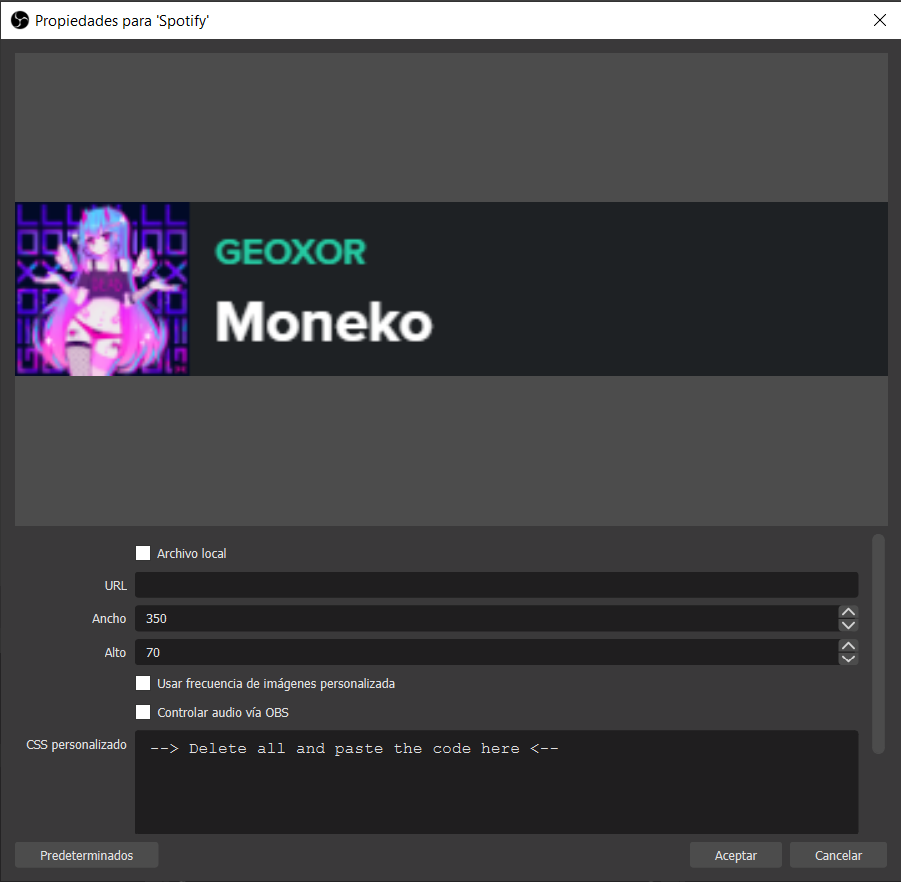

# Configuration for browser source in OBS
## Classic way
1. Just open the properties of the aidenwallis' Spotify Now Playing widget
2. Then paste the code of the theme as shown in the picture
- You can found all the themes in the folder "themes" of this [GitHub repository.](../../themes)
## Using @import
1. Just open the properties of the aidenwallis' Spotify Now Playing widget
2. Copy the link of the style file that you wish to use
3. Then go to [GitHubRaw](https://githubraw.com) or [raw.gitchack.com](https://raw.githack.com)
4. Paste the url and copy the new generated production url (you can also use the development url, but remember that it may have issues while importing)
5. Finally paste the new url of the theme as shown in the picture using `@import (url);`
- You can found all the themes in the folder "themes" of this [GitHub repository.](../../themes)   
*Note: Also works for Streamlabs OBS.*   

